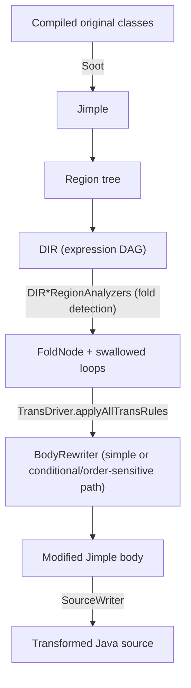

# DBridge

A Java program-rewrite tool that transforms iterative (per-row) JDBC access into
set-oriented (batched) access. It is an implementation of the techniques
described in:

> Chavan, Guravannavar, Ramachandra, Sudarshan. *"DBridge: A Program Rewrite
> Tool for Set-Oriented Query Execution"*, ICDE 2011.

The architecture mirrors the reference project
[scirpy](https://github.com/lazyfatpandas/public/tree/main/scirpy/parsePythonIR/src)
(same pattern, repurposed for **Java + JDBC** instead of Python + HQL/SQL).

---

## Overview

Given a Java program that runs a parameterized JDBC query inside a loop:

```java
Connection con = DriverManager.getConnection(url);
PreparedStatement pstmt = con.prepare(
        "SELECT count(partkey) FROM part WHERE category = ?");
while (category != -1) {
    pstmt.setInt(1, category);
    ResultSet rs = pstmt.executeQuery();
    if (rs.next()) {
        partCount = rs.getInt(1);
        total += partCount;
    }
    category = getParent(category);
}
```

DBridge rewrites it so the query is executed once for all parameter bindings:

```java
DBridgeConnection con = DBridgeConnection.getConnection("dbr:" + url);
DBridgePreparedStatement pstmt = con.prepareStatement(
        "SELECT count(partkey) FROM part WHERE category = ?");
while (category != -1) {
    pstmt.setInt(1, category);
    pstmt.addBatch();
    category = getParent(category);
}
pstmt.executeBatch();
while (pstmt.getMoreResults()) {
    ResultSet rs = pstmt.getResultSet();
    if (rs.next()) {
        partCount = rs.getInt(1);
        total += partCount;
    }
}
```

---

## Pipeline



1. **Parsing / IR** — `Main` loads compiled original classes, and Soot parses the selected method's JVM bytecode into Jimple.
2. **Region tree** — a structured control-flow tree (`LoopRegion`,
   `BranchRegion`, `SequentialRegion`) is built over the Jimple body.
3. **DIR analysis** — per-region analyzers walk the region tree bottom-up and
   build a **DIR**, a `Map<VarNode, Node>` mapping each variable to its defining
   algebraic expression (a DAG).
4. **Fold detection** — `DIRLoopRegionAnalyzer` detects accumulator variables
   (variables present in their own read set) and, when the loop-splitting
   precondition holds (the variable's only cyclic dependency is on itself),
   replaces the loop with a `FoldNode`.
5. **Rule engine** — `TransDriver` applies pattern-matching `Rule` objects
   (simplification/fold) to refine the DAG.
6. **Rewrite** — `BodyRewriter` handles the simple loop-splitting/query-rewrite
   path and the conditional/order-sensitive path. The latter uses guarded
   statements and `LoopContextTable` to preserve iteration order.
7. **Runtime** — `executeBatch()` materializes the bindings into a temporary
   table and rewrites the query to its set-oriented form.

`SourceWriter` replaces the selected method in the original source, preserving
the rest of the class and its exception/resource structure.

---

## Package layout

```
dbridge/
├── Main.java                       CLI entry point
├── analysis/
│   ├── region/                     Region tree over Jimple (CFG structuring)
│   │   ├── regions/                ARegion, Region, SequentialRegion,
│   │   │                           BranchRegion, BranchRegionSpecial, LoopRegion
│   │   ├── api/                    RegionAnalysis, RegionAnalyzer (visitor API)
│   │   └── RegionGraphBuilder.java
│   └── jdbc/                       DBridge analysis (Java + JDBC)
│       ├── expr/                   DIR + OpType + expression DAG nodes
│       │   └── node/               Node, VarNode, FoldNode, IfNode, InvokeMethodNode, ...
│       ├── construct/              StmtDIRConstructionHandler (Jimple → node)
│       ├── analysis/               DIR*RegionAnalyzer implementations
│       ├── trans/                  Rule, InputTree, OutputTree, TransDriver
│       ├── util/                   VarResolver
│       ├── FuncStackAnalyzer.java
│       └── JdbcDriver.java         Orchestrator (port of EqSQLDriver)
├── rewrite/
│   ├── BodyRewriter.java           Loop splitting → batched JDBC
│   ├── JavaWriter.java              Transformed Jimple method renderer
│   ├── SourceWriter.java            Source-preserving method replacement
│   └── SootDava.java                Source-emission facade
├── runtime/                        Runtime JDBC wrapper library
│   ├── DBridgeConnection.java
│   ├── DBridgePreparedStatement.java  bind/addBatch/executeBatch/getMoreResults/
│   │                                  getResultSet + set-oriented query rewrite
│   ├── LoopContextTable.java       Ordered context table (order-sensitive ops)
│   └── Record.java
└── visitor/                        NodeVisitor, Visitable
```

---

## Key data structures

### Region tree (`dbridge.analysis.region`)

A structured representation of control flow, built from Soot's
`BriefBlockGraph`/`BriefUnitGraph`. Nodes: `Region` (basic block),
`SequentialRegion`, `BranchRegion`, `BranchRegionSpecial`, `LoopRegion`.

### DIR (`dbridge.analysis.jdbc.expr.DIR`)

A `Map<VarNode, Node>` mapping each program variable to the expression DAG that
defines its value. This is the central structure the transformation rules
operate on.

### Expression nodes (`dbridge.analysis.jdbc.expr.node.Node`)

Each node has an `OpType`, child nodes, an optional region, and the originating
Jimple statements. `readSet()` returns the set of variables read by a node.
Key nodes: `VarNode`, `RetVarNode`, `FoldNode` (loop aggregate), `IfNode`
(conditional), `InvokeMethodNode`, `BinaryOpNode`, `UnAlgNode`.

### Rule engine (`dbridge.analysis.jdbc.trans`)

A `Rule` matches an `InputTree` pattern (binding matched subnodes by id),
checks preconditions, and constructs the replacement from an `OutputTree`.
`TransDriver` applies simplification and fold rules iteratively.

---

## Region analyzers

`RegionAnalyzer.initialize(...)` registers one analyzer per region type:

| Analyzer | Purpose |
|---|---|
| `DIRRegionAnalyzer` | Basic block → DIR entries |
| `DIRSequentialRegionAnalyzer` | Merge two sub-DIRs (resolve variable refs) |
| `DIRBranchRegionAnalyzer` | Combine true/false branches into `IfNode` expressions |
| `DIRBranchRegionSpecialAnalyzer` | Single-branch conditional |
| `DIRLoopRegionAnalyzer` | Detect accumulators → `FoldNode` |

`DIRLoopRegionAnalyzer` is the core: it finds variables updated in the loop
body that read themselves (aggregation), identifies the loop induction
variable, and, if an accumulator has a cyclic dependency only on itself, emits
a `FoldNode` and records the "swallowed" loop.

---

## Runtime (set-oriented query rewrite)

`DBridgePreparedStatement.executeBatch()`:

1. Parses the SQL with JSqlParser.
2. Creates a temporary table `pb` and materializes all collected bindings.
3. Rewrites a scalar aggregate
   `SELECT <agg> FROM <t> WHERE <col> = ?` into the unnest form
   `SELECT <agg> FROM pb LEFT JOIN <t> ON pb.<col> = <t>.<col> GROUP BY pb.<col>`
   (the equivalent of the paper's `OUTER APPLY`/`LATERAL` rewrite).
4. Executes it once and exposes a single multi-row `ResultSet` via `getResultSet()`.
   For order-sensitive programs, `LoopContextTable.mergeResults(...)` matches each
    result row back to its record by a stable batch ordinal, preserving duplicate
    bindings and loop order.

Non-aggregate statements (e.g. `INSERT`) use the native JDBC batch.

---

## Building and running

Requires JDK 8 and Maven.

```bash
cd /path/to/dbridge
export JAVA_HOME="/Library/Java/JavaVirtualMachines/temurin-8.jdk/Contents/Home"
export PATH="$JAVA_HOME/bin:$PATH"

mvn test            # run all tests (7 tests)

# transform an example method
mvn -q compile test-compile dependency:build-classpath -Dmdep.outputFile=/tmp/cp.txt
CP="target/classes:target/test-classes:$(cat /tmp/cp.txt)"
java -cp "$CP" dbridge.Main \
  "target/classes:target/test-classes" \
  dbridge.test.Example1 \
  "int getTotalPartCount(int)" \
  /tmp/out.java /path/to/Example1.java
```

The input classpath must contain compiled classes. Supplying the original source
replaces the selected method and writes a complete transformed source file.

---

## End-to-end example

`examples/run.sh` runs a complete, runnable demo on
`dbridge.example.PartCountApp.computeTotal`, exercising statement reordering,
loop splitting, query rewriting, conditional blocks, and order-sensitive
operations:

| Method | Where in the program |
|---|---|
| Statement reordering | loop-var update separated from the query |
| Loop splitting | one binding loop + one result loop |
| Query rewrite | `executeBatch()` runs a set-oriented query |
| Conditional blocks | `if (isActive)` becomes a guarded boolean flag |
| Order-sensitive ops | `log(...)` observes iteration order via `LoopContextTable` |

```bash
cd /path/to/dbridge
export JAVA_HOME="/Library/Java/JavaVirtualMachines/temurin-8.jdk/Contents/Home"
export PATH="$JAVA_HOME/bin:$PATH"

bash examples/run.sh          # default: 50000 categories
bash examples/run.sh 100000   # custom number of categories
```

Example output:

```
==> Categories: 50000
==> Building DBridge runtime (skip tests)
==> Compiling original application
==> Transforming PartCountApp.computeTotal with DBridge
==> Generating optimized application from transformed method
==> Compiling optimized application
==> Running ORIGINAL application (iterative JDBC)
RESULT=75000
LOG_HASH=938711584
SETUP_MS=1026
QUERY_MS=149
==> Running OPTIMIZED application (batched JDBC)
RESULT=75000
LOG_HASH=938711584
SETUP_MS=1037
QUERY_MS=300

==> Comparison
Result - original : 75000
Result - optimized: 75000
Log hash - original : 938711584
Log hash - optimized: 938711584
CORRECTNESS: PASS (result and order match)
Query time - original : 149 ms
Query time - optimized: 300 ms
```

`RESULT` (the aggregate) and `LOG_HASH` (the order-sensitive side effect) must
match. The comparison checks both values and reports whether the transformed
method preserved the original result and log order.

> Performance note: H2 is in-memory, so an indexed point query is already ~microseconds,
> and the batched form's `LoopContextTable` bookkeeping can outweigh the saved
> round-trips. The speedup materializes on databases with network round-trip
> latency or expensive random I/O.

`examples/PartCountApp.java` is the original source. `examples/run.sh` first
compiles it into `examples/build/original-classes`, analyzes that compiled class
with DBridge, and writes a source-preserving transformation to
`examples/build/PartCountApp.java`, then compiles that class into
`examples/build/optimized-classes`. The original and optimized applications are
run from their separate class directories and their `RESULT` and `LOG_HASH`
values are compared. All generated artifacts live under `examples/build`.

The `.class` files in those directories are JVM bytecode, not Java source. DBridge
analyzes the bytecode and replaces the transformed method in the original source.

---

## Tests

| Test | What it verifies |
|---|---|
| `JdbcDriverTest` | Fold detection (loop → `FoldNode`, 1 swallowed loop) |
| `BodyRewriterTest` | Transformed Jimple contains `addBatch`/`executeBatch`/`getResultSet` |
| `SootDavaTest` | Source-preserving transformed class contains the rewritten method |
| `DBridgeRuntimeTest` | Set-oriented rewrite correctness vs H2 (incl. LEFT JOIN zero-count), duplicate/order-preserving merge, repeated execution, native INSERT batch |
| `IntegrationTest` | Original vs transformed produce identical results on H2 |

---

## Known limitations

- Query rewrite covers a scalar aggregate `SELECT … WHERE col = ?` and bulk
  `INSERT`; arbitrary SQL and multi-parameter `WHERE` predicates are not yet
  handled.
- `BodyRewriter` recognizes the supported loop shapes rather than arbitrary
  Java control flow. The simple path handles a query-bearing loop; the
  conditional/order-sensitive path currently batches inactive categories too
  and filters them during result consumption.
- Nested loops are the next extension.
- Source emission supports the regular paper-scope transformed method shape;
  arbitrary Java control flow and overloaded-source method resolution are not
  yet handled.
